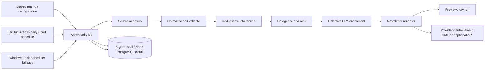

# Personal News Intelligence Agent — V1 Architecture

> **Implementation status (updated 2026-10-02):** The running code is a Python 3.12 modular monolith. It includes RSS/Atom ingestion and normalization, conservative exact-signal deduplication, deterministic categories/ranking/selection, optional selected-story LLM summaries with source-text fallback, HTML/text rendering, preview/send CLI modes, SQLite and PostgreSQL run-history repositories, structured logs, local `.env` loading, Gmail-compatible SMTP, and a durable per-day delivery-claim ledger. A GitHub Actions + Neon PostgreSQL cloud workflow is now defined for production at 07:00 Asia/Kolkata, with environment-secret SMTP support. It is not deployed or active: this repository has no remote configured and no GitHub/Neon account or secrets are connected. The existing Windows Task Scheduler remains registered as a local fallback. See `cloud-deployment.md` for activation steps.

## 1. Proposal and V1 boundaries

V1 is one Python application, implemented as a modular monolith and invoked as a daily batch job. It reads enabled sources, normalizes entries into in-memory articles, deduplicates them into in-memory stories, categorizes and ranks the stories, optionally enriches selected stories, renders a newsletter, and either saves a local preview or optionally sends email. Only run and delivery-claim metadata are persisted.

The modules are boundaries inside one application; they are not separately deployed services. There is no microservice architecture, vector database, agent framework, dashboard, or mobile app. V1 has one owner and recipient, a curated source list, a daily digest, conservative deterministic deduplication, explainable ranking, optional LLM summaries/significance, and preview before sending. V1 does not promise exhaustive coverage, real-time alerts, objective importance, or error-free AI text.

### Component view

## 2. Canonical data contracts

Pipeline boundaries exchange validated typed records after source normalization. Timestamps are timezone-aware UTC instants internally. Text and collection sizes are bounded at ingestion. The contracts below describe the current code, except where explicitly marked as conceptual.

### 2.1 Canonical `Article` (Normalized Article)

An `Article` represents one publisher's article/feed entry. It is immutable after normalization except for ingestion bookkeeping; enrichment and clustering are separate records.

| Field | Type | Required? | Validation / meaning |
|---|---|---:|---|
| `article_id` | string (UUID) | Yes | Generated by the application; stable for this stored record. |
| `source_id` | string | Yes | Must refer to an enabled or historically known source configuration entry. |
| `publisher` | string | Yes | Non-empty, trimmed, bounded (for example 200 characters); configured display name. |
| `title` | string | Yes | Non-empty after trimming, bounded (for example 500 characters); source-controlled plain text, not HTML. |
| `url` | string (absolute URL) | Yes | Must use `http` or `https`, have a host, and be bounded; original publisher/feed URL retained for display. |
| `canonical_url` | string (absolute URL) | Yes | Derived matching key: normalize host/scheme casing and safe tracking parameters/fragments only; never replace `url`. |
| `published_at` | UTC datetime or null | No | Parsed from source; null if unavailable/unparseable, with no substitution from retrieval time. |
| `retrieved_at` | UTC datetime | Yes | Time this item was fetched; must be timezone-aware. |
| `description` | string or null | No | Plain text only; strip markup, trim, and cap length (for example 4,000 characters). |
| `source_categories` | list[string] | No | Publisher/API tags after whitespace normalization and per-item/count limits. |
| `language` | string or null | No | Optional normalized language tag (BCP 47 where detectable). |
| `content_hash` | string | Yes | Stable hash of normalized source identity/content fields for change detection; not a story identity. |

Validation rejects an item if it lacks a usable title or HTTP(S) URL, exceeds hard size limits, or has invalid required values. Invalid optional fields are nulled and reported rather than guessed. Duplicate canonical URLs refer to an existing article record or are linked as another source occurrence according to persistence policy. Original URLs and publisher timestamps must remain retrievable.

### 2.2 Pipeline stage contracts

| Stage output | Contract | Invariants |
|---|---|---|
| **Source Adapter → raw entry → Normalizer → Normalized Article** | Adapter returns provider-specific raw entries; the normalizer validates them and returns canonical `Article` objects plus item-level issues. | Provider fields do not escape into later stages. One malformed item does not invalidate other entries. |
| **Normalized Article → Deduplicated Story** | A `Story` retains its member `Article`s and provenance; deduplication results also report duplicate-to-retained relationships and deterministic reasons. | No member is lost. Keep each member's original URL, publisher and publication time. Only exact canonical/normalized URL and identical content hash are used. |
| **Deduplicated Story → Ranked Story** | `RankedStory` wraps a `CategorizedStory`, its score, named signal breakdown, and candidate/unclassified selection status. | Scoring is reproducible from inputs, configuration, and the run `as_of` time. The ranking config version is not persisted. Per-category and total caps apply during selection. |
| **Ranked Story → AI Enriched Story** | `AIEnrichedStory` contains the `RankedStory`, `summary`, `why_it_matters`, `model/provider identifier`, `prompt/schema version`, generation timestamp, and status (`generated`, `fallback`, `failed`). | Text is bounded, schema-validated, grounded only in provided member metadata/descriptions, and retains source references. Failed generation is explicit. |
| **AI Enriched Story → NewsletterDocument** | The renderer consumes enriched stories and produces HTML plus plain text. | Dynamic values are escaped in HTML; validated article URLs are retained as links. Plain-text output is separate and contains inert textual source content. |

Separate database rows/tables are appropriate for articles, stories, story membership, run records, and delivery records. `Story`/`RankedStory`/enrichment are logical contracts and do not require separate services or elaborate object storage.

## 3. Source configuration model

Sources are data, not hard-coded branches. A version-controlled configuration file (for example YAML) contains a list of source entries. Adding or disabling a source means editing configuration and redeploying/restarting the scheduled job; no application code change is needed when the source uses a supported adapter type.

Each entry has:

| Setting | Type | Purpose |
|---|---|---|
| `source_id` | unique string | Stable key used in articles and logs; do not reuse after deletion. |
| `enabled` | boolean | `false` skips fetching without deleting historical records. |
| `name` | string | Publisher display name. |
| `kind` | enum | Supported adapter type such as `rss`/`atom` or a named supported API provider. |
| `endpoint` | URL/string | Feed URL or API endpoint; secrets must not be embedded in URLs/config committed to source control. |
| `credential_env` | string or null | Name of environment variable containing the API credential; secret value is injected at runtime. |
| `categories` | list of configured section names | Sections this source may contribute to; rules can further classify entries. |
| `quality_weight` | number in configured range | Reviewed source prior, used as one ranking input; does not assert truth. |
| `timeout_seconds` | positive bounded number | Per-source request timeout within application maximum. |
| `request_interval_seconds` | positive bounded number | Respectful rate limit, especially for APIs. |
| `language` | string or null | Optional expected feed language. |

Startup validates unique IDs, supported `kind`, valid endpoint, categories, bounds, and required credential-variable presence for enabled API entries. An unknown adapter type is a configuration error, since configuration cannot invent a new protocol. For feeds, add an entry with its URL. For a new API provider, a one-time adapter implementation is required; thereafter instances/endpoints using that adapter can be configured without further code changes. Keep source history in SQLite and mark disabled sources inactive rather than deleting their articles.

## 4. Components and technology choices

### A. Configuration and runner

One command-line entry point supports preview and explicit send modes. It validates configuration, creates a run ID, uses a single run timestamp, and orchestrates stages. There is no configurable publication lookback filter. This avoids divergent local and cloud behavior.

### B. Source adapters and normalization

Use RSS/Atom first with an HTTP client having timeouts and bounded retries. Add a licensed API adapter only where source coverage requires it. Normalize into the canonical `Article` contract and isolate source-specific parsing. Do not scrape full publisher sites by default; use content permitted by feed/API terms.

Python is selected for readability and its mature feed, HTTP, validation, SQL, and templating ecosystem. A modest dependency set is preferable; use typed models and explicit validation at boundaries.

### C. Persistence — SQLite locally; PostgreSQL for cloud production

The current implementation persists pipeline run history and a separate durable daily delivery-claim ledger; it does not persist articles, stories, enrichment results, or newsletter bodies. SQLite is the default local database. The selected cloud production workflow uses PostgreSQL explicitly through `DATABASE_BACKEND=postgres` and `DATABASE_URL`. Both backends implement the same repository interface. There is no automatic fallback between databases. Back up the SQLite file because losing it also loses local run history and duplicate-send protection.

SQLite keeps setup simple for local development and fallback. A SQLite file inside a replaceable cloud runner is ephemeral, so the selected GitHub Actions workflow requires external Neon PostgreSQL for durable run history and daily delivery claims. The existing Cloud Run proposal in `deployment.md` remains an optional alternative.

### D. Deduplication and story clustering

The implemented deduplicator uses exact canonical/normalized URL and identical content-hash signals, with deterministic retained-article selection and provenance reporting. The hash payload includes source ID and publisher, so cross-publisher reports generally merge only when their canonical URLs match. It deliberately does not use fuzzy title similarity, embeddings, or a vector database.

### E. Categorization and ranking

Map source tags and deterministic keyword rules to the eight categories. Unmatched stories remain unclassified. Ranking and selection are deterministic and use configuration; the LLM does not determine story importance or categories.

### F. LLM adapter

Keep model calls behind one small provider interface, with schema validation, timeouts, bounded attempts, and versioned prompts. Calls are limited to selected stories; do not assume a hard cost budget is enforced by code. The LLM is for selected story synthesis and explanation, not for raw feed ingestion or general autonomous decisions. Provider/model selection remains a configuration decision after reviewing current cost and data-retention terms.

### G. Renderer and email adapter

Render validated story data into simple semantic HTML plus a plain-text alternative. All source/model text is treated as untrusted and escaped. The free-first email adapter is SMTP; an optional Resend API adapter also exists. Local preview does not call either provider.

### H. Runtime and scheduler

Develop locally and execute production through the GitHub-hosted scheduled workflow described in `cloud-deployment.md`. The cloud runner is ephemeral; it uses Neon PostgreSQL for durable run and delivery-claim metadata. The local fallback continues to use SQLite.

## 5. High-level ranking strategy

Ranking is deterministic by default and produces a bounded score plus signal breakdown. Initial signals:

- **Freshness (deterministic):** age from `published_at`; unknown or future publication time receives no freshness credit. V1 has no publication lookback exclusion, so freshness alone does not remove a story.
- **Source quality prior (deterministic/configured):** reviewed `quality_weight` from source configuration.
- **Topic/category relevance (deterministic):** source tags and configured keyword/rule matches against title and description.
- **Independent corroboration (deterministic):** number of distinct configured publishers covering a deduplicated story, with a cap to prevent volume dominating.
- **Coverage balancing (deterministic):** category quotas/caps and maximum total items applied after candidate scoring.

Weights, freshness decay, and caps are configuration values. The active values are not version-stamped in run metadata. The score is a transparent selection aid, not a factual measure of significance.

The LLM is used only for summary and “why it matters” enrichment of selected stories. Category assignment is deterministic; LLM classification is not implemented. LLM outputs do not set source-quality weights, corroboration counts, publication time, or the primary importance score in V1. This separation keeps selection reproducible and reduces cost and model variance.

## 6. LLM use and non-use

**Used for:**

- Generate a concise summary and a separate significance explanation for stories that pass deterministic selection, one call per selected story, with the provider output length bounded by request configuration.

**Not used for:**

- Reading or classifying raw feed entries; only selected stories are enriched.
- Fetching news, verifying that an article is true, deciding that a publisher is reliable, inventing missing metadata, or replacing original links/times.
- Exact URL deduplication, primary ranking score, send policy, or arbitrary agent/tool actions.

The LLM receives only title, publisher, publication time if known, URL, category clues, and bounded feed description/snippets from the selected story's members. Do not send full article text in V1. Validate structured output and length; instruct the model to state uncertainty and not introduce facts absent from the supplied material. Retain links beside output. A fallback is clearly labeled source description, or story omission if no usable description exists.

## 7. Data flow and preview/dry-run behavior

1. Runner validates configuration and persists a run record through the selected repository (SQLite locally or PostgreSQL explicitly); it uses one UTC `as_of` reference time for stage determinism.
2. Enabled source adapters fetch independently. Successful feeds continue when another source fails.
3. Normalization validates each item and passes valid `Article` records forward; rejected entries and issues are counted without dumping source content into operational logs.
4. Exact canonical/normalized URL or content-hash matches are deduplicated into in-memory `Story` clusters; fuzzy near-duplicate matching is not implemented.
5. Stories receive deterministic categories, score/signal breakdown, and selection status. Per-section and total caps are applied.
6. Only selected stories reach the LLM when enrichment is enabled. Outputs are validated or marked fallback/failed.
7. Renderer creates HTML and text from enriched story records, escapes dynamic HTML values, and writes local preview artifacts.
8. In **preview/dry-run mode** (the safe default): fetch, normalize, deduplicate, rank, optionally summarize only when `--with-ai` is supplied, render local artifacts, and print run counts/path/status. Do not call the email provider or require email credentials. Run metadata is persisted when the selected repository is available.
9. In **send mode**, use the optional email provider only when complete provider configuration and credentials are available. If email is not configured, summarize selected stories when an LLM is configured, render the newsletter, and save local HTML/TXT artifacts without attempting delivery. When email is enabled, claim a stable recipient/date key before calling the provider. The unique delivery row prevents another same-day attempt across sequential or concurrent processes. The ledger stores a sanitized outcome and provider message ID where available, but never a recipient, body, or credential. An ambiguous SMTP attempt remains claimed and must be checked before any manual intervention.
10. Close the run with stage counts, durations, partial-failure warnings, and status. A partial run is visible even when a shorter newsletter can be rendered.

Preview should be used to inspect story choices, link preservation, publication time rendering, and AI text before the first real send. Real sends should require explicit configuration/command and never be the implicit behavior of a local run.

## 8. Failure handling

| Failure | V1 behavior |
|---|---|
| **Source unavailable** (timeout, HTTP error, invalid feed/API response) | Apply bounded timeout/retry, mark that source failed, continue with others, and mark the run partial. If all sources fail, do not send an empty-as-normal newsletter; fail the run and retain diagnostics. |
| **Malformed article** | Reject only that item, record source and validation reason, continue processing valid items. Missing optional description/time is allowed; invalid title or URL is not. Never substitute retrieval time for missing publication time. |
| **Database failure** | A run-history creation failure stops the pipeline before source or delivery work; a completion failure returns `persistence_failed`. PostgreSQL errors do not switch to SQLite. Review delivery status before repeating any run whose external delivery may already have been accepted. |
| **LLM failure** (timeout, quota, invalid schema, refusal) | Make only the configured bounded attempts. Use a labeled source-description fallback when available; otherwise omit that story. Record the failure and continue rendering/saving local output. Email delivery remains optional and is never attempted in preview mode. Calls are limited to selected stories, but V1 does not enforce a monetary cost cap. |
| **Email configuration absent** | Treat delivery as disabled, not a pipeline failure. Save the HTML/TXT issue locally and persist the run; do not contact an email provider. |
| **Email failure** | When optional email is enabled, record rejected/failed when known and leave the run undelivered. Retry explicit transient SMTP responses only within the configured bounded attempts; do not retry a permanent rejection. For timeout/ambiguous acceptance, mark outcome unknown and retain the unique SQLite daily claim, so another task invocation cannot resend. Never mark delivered before provider acceptance. |

Exactly-once delivery across SQLite and an external mail provider cannot be guaranteed. The delivery claim prevents a second local attempt for the same recipient/date. The explicit `delivery-reset --date YYYY-MM-DD` CLI utility deletes only the configured recipient's claim for that date and exists for development/testing retries; it must not be part of the daily scheduler. After ambiguous provider acceptance, check provider records before using it. The command does not change the scheduler's configured mode; whenever the normal `send` mode is used, its existing idempotency protection remains active.

## 9. Technology choices

| Area | V1 decision | Reason / tradeoff |
|---|---|---|
| Language/runtime | Python 3, supported release pinned for deployment | Readable, mature ecosystem, approachable for learning. |
| Application shape | Modular monolith and CLI batch | One deployable artifact; simple boundaries without service orchestration. |
| Sources | Curated RSS/Atom first; supported licensed API adapters as needed | Low cost and source links; varying coverage, quality, and freshness. |
| Validation | Typed records with explicit boundary validation | Makes contracts visible and malformed provider data local to ingestion. |
| HTTP | Small client with explicit timeout and bounded retry | Testable adapters and predictable run duration. |
| Database | SQLite locally; PostgreSQL for cloud production | Simple local state plus durable cloud claims, with no automatic fallback. |
| Deduplication | Canonical/normalized URL and content hash | Conservative, explainable, and deterministic; may leave some duplicates. |
| LLM | One hosted model behind adapter, selected before implementation | Useful synthesis without running a model; costs, latency, privacy, and hallucination risks. |
| Email | Provider-neutral SMTP adapter for the free local path; Resend API retained as optional | Avoids a required paid email service; account-specific SMTP restrictions and ambiguous delivery remain limitations. |
| Rendering | Autoescaping template plus text alternative | Safer source rendering and separable presentation; email CSS support varies. |
| Deployment | GitHub Actions + Neon PostgreSQL for cloud; Windows Task Scheduler as fallback | Cloud execution does not require the PC; free-tier quotas and best-effort start time apply. |

No credentials belong in source control. Use the gitignored local `.env` for local LLM configuration and Windows Credential Manager for local SMTP credentials. Cloud secrets are injected by GitHub Actions. Review provider terms, privacy, and quotas before use.

## 10. External APIs and services

1. **News inputs:** public RSS/Atom feeds and optionally a licensed news API. Terms, rate limits, and republication rights vary; store metadata/snippets only as permitted.
2. **LLM API:** one hosted model for selected story summaries and significance explanations. Send minimal bounded text and review provider data-retention settings. The application bounds which stories and attempts reach the provider, but does not enforce a monetary spend limit.
3. **Email transport:** Gmail-compatible SMTP over STARTTLS is an optional free personal-account path with a credential stored in Windows Credential Manager. Account eligibility and delivery are not guaranteed. Local HTML/TXT plus manual email remains a safe alternative. The existing Resend API adapter is optional and may be paid.
4. **Deployment services:** Windows Task Scheduler is the current target. Cloud Run Jobs, Cloud Scheduler, Secret Manager, Artifact Registry, Cloud Logging, and Cloud SQL PostgreSQL are documented only as a future upgrade requiring billing-enabled infrastructure.

## 11. Testing strategy

- Unit tests for URL canonicalization, timestamps/time zones, normalization, duplicate positive/negative pairs, categories, score breakdown/caps, AI response validation, rendering/escaping, and run idempotency keys.
- Small sanitized feed fixtures for all categories, malformed dates, missing optional values, Unicode, and malformed records; do not retain copyrighted full articles.
- Mock adapter tests for source timeout/retry, LLM failure/schema errors and budget limits, and email acceptance/rejection/timeout/idempotency behavior.
- SQLite integration tests for schema migrations, uniqueness, upserts, transaction rollback, run records, and safe repeated preview/send logic. Back up and restore a database fixture to exercise persistence.
- Pipeline integration tests with fixture sources and stubbed LLM/email; assert article provenance, story membership, category coverage, fallback handling, and that preview never invokes email.
- End-to-end preview against a small live feed set, followed by manual artifact inspection. Live model/email checks are opt-in and low-volume; normal tests do not incur uncontrolled costs or send real mail.
- Deployment checks for persistent-volume behavior, serialized scheduled runs, secrets injection, exit status/logging, backup restore, and configured timezone/DST boundaries.

## 12. Deployment approach

**Local phase:** run from CLI with SQLite in a known local data directory; preview is default and mail credentials are unnecessary. Use a small source list, inspect generated output, and keep local secrets out of version control.

The CLI emits JSON `pipeline.run.started` and `pipeline.run.finished` events to stderr with run identifiers, timestamps, status, counts, delivery outcome, and sanitized failure metadata. It does not log credentials, provider error messages, source descriptions, or rendered newsletter content. GitHub Actions CI runs tests and Ruff; a separate production workflow is documented in `cloud-deployment.md` and requires account/secret setup.

**Production automation:** `.github/workflows/daily-newsletter.yml` schedules `personal-news-agent send` on GitHub's hosted runner at 01:30 UTC (07:00 Asia/Kolkata), using Neon PostgreSQL for durable claims. It is not active until the workflow is pushed to the repository's default branch and GitHub/Neon secrets are configured. See [`cloud-deployment.md`](cloud-deployment.md). **Local fallback:** the PowerShell wrapper invokes `.venv\Scripts\personal-news-agent.exe send` through the registered Windows Task Scheduler task at 07:00 India Standard Time as the interactive Dell account. It writes logs under the project data directory and requires the account signed in. See [`free-local-deployment.md`](free-local-deployment.md).

**Optional alternate cloud migration:** the existing container/PostgreSQL preparation can support Cloud Run Jobs with `DATABASE_BACKEND=postgres`, Cloud SQL connectivity, Secret Manager, and a daily scheduler. This paid alternative is described in [`deployment.md`](deployment.md); it has not been deployed.

Start in preview mode in deployment and inspect artifacts/logs. Then use provider sandbox delivery, verify sender and recipient, and explicitly enable production sending. Configure bounded runtime/retries and an alert for repeated failure or missing daily run. Database schema changes use reviewed migrations; backup/restore is exercised before unattended operation.

## 13. Future Improvements (not in V1)

These are possible later changes only, and must not be pulled into the initial implementation without a separate requirements decision:

- Migrate SQLite to managed PostgreSQL if concurrency, multiple job instances, or operational constraints outgrow a persistent single-writer file.
- Add a paid news aggregation/search API after evaluating measured coverage gaps and terms.
- Improve semantic duplicate detection using embeddings or a vector store if conservative title matching proves insufficient.
- Add user profiles, multiple recipients, feedback-based personalization, a web dashboard, or mobile clients.
- Add breaking-news/near-real-time delivery, interactive review, or human editorial approval workflows.
- Add richer source quality evaluation, multilingual translation, and cross-language clustering.
- Add advanced monitoring, cost dashboards, and automated source health scoring.

## 14. Key tradeoffs

- RSS is inexpensive but can be delayed or inconsistent; use a curated set and measure missing coverage.
- SQLite makes V1 accessible and cost-light, but its persistent file must be protected and only one writer should run at a time.
- Conservative deduplication can leave repeats; aggressive matching can erase distinct events.
- LLM enrichment can be wrong; limit its role, preserve sources, validate outputs, and review previews.
- A daily newsletter is a time-bounded snapshot, not a breaking-news service.

